# how-to-flutter
[](https://github.com/jonashackt/how-to-flutter/actions)
[](https://github.com/jonashackt/how-to-flutter/blob/master/LICENSE)
[](https://renovatebot.com)

A backend engineer looking into cross-plattform mobile development


## My goal: get into both App Stores as quickly as possible

As a "DevOps / backend focussed engineer" I finally wanted to have a look into app development.

For me it was crucial to get a head start without much friction. My goal was to get a running app out into both the Android and Apple AppStores as quickly as possible.

So I opted for cross-platform development frameworks and read some current "popular frameworks in this space" articles like https://hackernoon.com/9-popular-cross-platform-tools-for-app-development-in-2019-53765004761b

Soon I realized both React Native and Flutter are the top dogs today, so I read more about them https://hackr.io/blog/react-native-vs-flutter

Eating my own dogfood I asked myself: what are my requirements? The "when to use Flutter section" got me:

```
When to Use Flutter

    Small budgets
    Short development timeline
    UI-centered apps
    Iteration (Hot Reload)
```

`small budgets` and `short development timeline` both sound like the thing I was looking for to "get into both App Stores as quickly as possible".


## Flutter & Dart

https://flutter.dev is based on Google's https://dart.dev programming language, which is focussed to be a `a client-optimized language for fast apps on any platform` - sounds good, although I need to learn a new language.

Dart is compiled to ARM & x64 machine code for mobile, desktop, and backend. Or compile to JavaScript for the web. It also uses AOT-compilation for performance and should be much faster then React Native, since there's no separate thread using JavaScript anymore. Everything is compiled to native!

Sounds really nice, so let's get our hands dirty: https://flutter.dev/learn


## Prepare your dev environment for Flutter

### Install Dart SDK

This is mainly to have a Dart SDK available in IntelliJ (which we might also have using only flutter installation, but will check that later):

https://dart.dev/get-dart

```shell
brew tap dart-lang/dart
brew install dart
```

### Install Flutter SDK

https://docs.flutter.dev/get-started/install/macos

On a mac we can install Flutter using brew:

```shell
brew install flutter
```

You can grab yourself a coffee now - this may take a while (2.8 gigs).

When this finished, you should run 

```shell
flutter doctor
```

This should show you, what is missing on your machine!


### iOS simulator

Using the iOS simulator no device is required.

https://docs.flutter.dev/get-started/install/macos#set-up-the-ios-simulator

Open it via

```
open -a Simulator
```

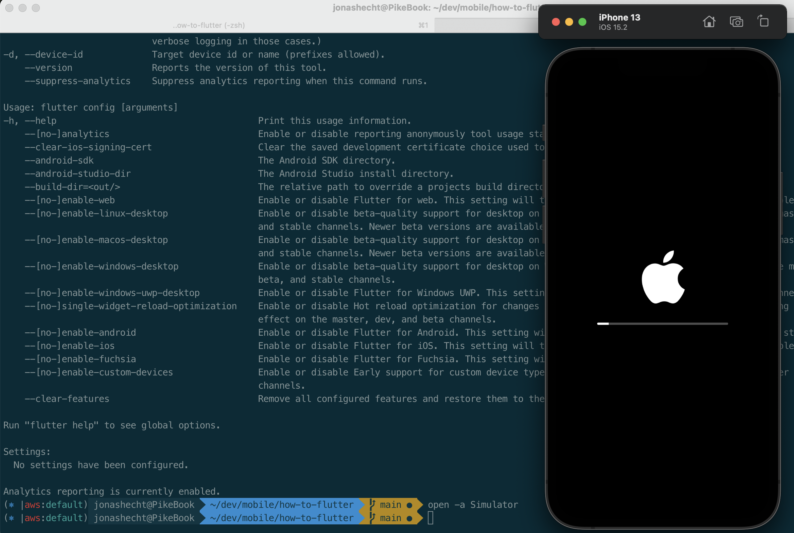


### iOS setup

These steps are required if you want to use your iPhone device itself to testdrive your Flutter app.

https://docs.flutter.dev/get-started/install/macos

> To deploy your Flutter app to a physical iOS device you’ll need to set up physical device deployment in Xcode and an Apple Developer account. If your app is using Flutter plugins, you will also need the third-party CocoaPods dependency manager.

#### Update MacOS, XCode & CommandLineTools

First be sure to have your latest MacOS installed:

```shell
softwareupdate --all --install --force
```

https://docs.flutter.dev/get-started/install/macos#install-xcode

For iOS development we need XCode to be installed (e.g. via the Mac App Store).


#### CocoaPods

```shell
sudo gem install cocoapods
```

If that does fail with 
```
The compiler failed to generate an executable file. (RuntimeError) You have to install development tools first.
```

you should know that https://stackoverflow.com/a/65481787/4964553

> Recent versions of macOS and Xcode (e.g. Catalina, Big Sur and so on) definitely have this broken.

Therefore follow the so answer. On my BigSur this was what made the `cocoapods` installation work

```
cd /Applications/Xcode.app/Contents/Developer/Platforms/MacOSX.platform/Developer/SDKs/MacOSX12.1.sdk/System/Library/Frameworks/Ruby.framework/Versions/2.6/usr/include/ruby-2.6.0/ruby/
sudo ln -sf ../../../../Headers/ruby/config.h
cd /Applications/Xcode.app/Contents/Developer/Platforms/MacOSX.platform/Developer/SDKs/MacOSX12.1.sdk/System/Library/Frameworks/Ruby.framework/Versions/2.6/usr/include/ruby-2.6.0
sudo ln -sf universal-darwin21 universal-darwin20
```

#### Xcode signing flow

Run the following in the root of the project:

```
open ios/Runner.xcworkspace
```

This should fire up Xcode using our Flutter generated project:

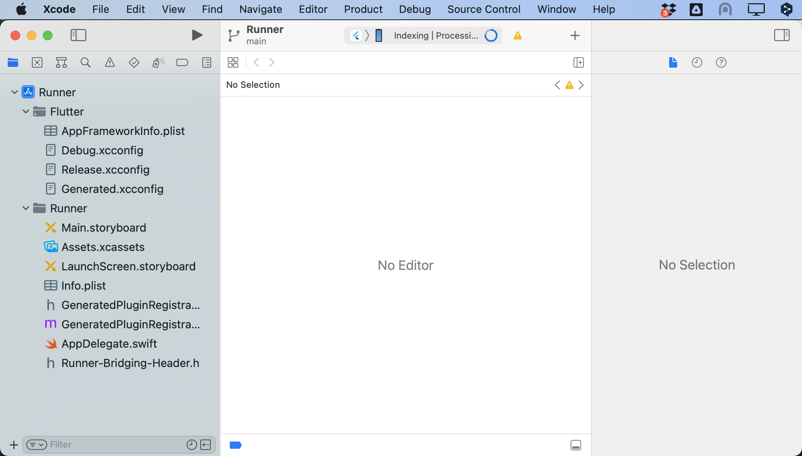

Now select a __Team__ using __Add Account...__ under __Signing & Capabilities__ inside the __Runner__ configuration.

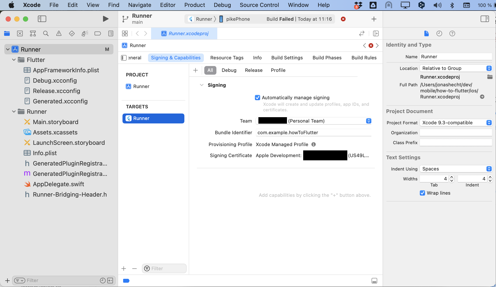

You definitely need to trust the new Xcode generated developer certificate on your iPhone (sorry, I only have a german iOS here): 

> go to the Settings app on the iOS device, select General > Device Management and trust your Certificate. For first time users, you may need to select General > Profiles > Device Management instead.

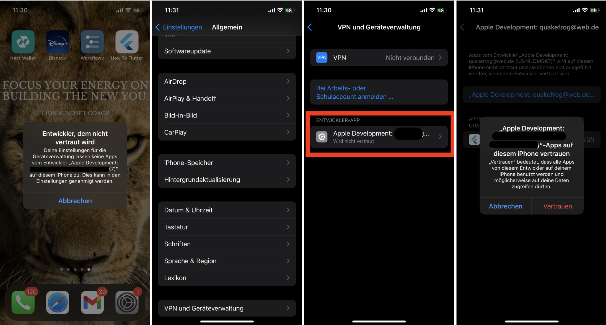

For more details have a look at https://docs.flutter.dev/get-started/install/macos#deploy-to-ios-devices

> Development and testing is supported for any Apple ID. Enrolling in the Apple Developer Program is required to distribute your app to the App Store (see https://developer.apple.com/support/compare-memberships)


Now click onto the run icon in Xcode or execute `flutter run` on command line. Your app should be started on your iPhone! :)

If you experience `iproxy` beeing blocked on your Mac like this:

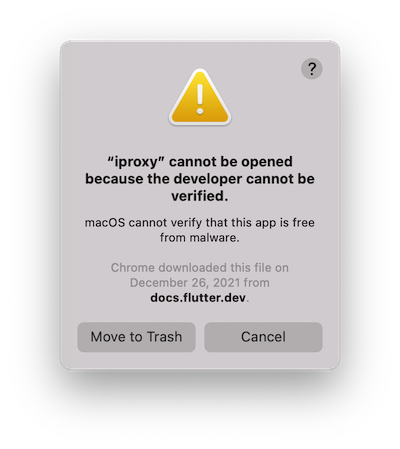

run the following (see https://stackoverflow.com/a/71359133/4964553):

```shell
# look where flutter sdk is located - if you used brew that is
/usr/local/Caskroom/flutter/2.10.5/flutter/bin/
# then cd to flutter-sdk-path/bin/cache/artifacts/usbmuxd
cd /usr/local/Caskroom/flutter/2.10.5/flutter/bin/cache/artifacts/usbmuxd
# deactivate MacOS blocking for iproxy
sudo xattr -d com.apple.quarantine iproxy
```


### Android setup

https://docs.flutter.dev/get-started/install/macos#android-setup

Install Android Studio (do not use `brew install android-sdk`, since it has been officially discontinued upstream)

```
brew install android-studio
```

Then start Android Studio and you should see the Wizard waiting. Here choose the standard installation and the `Android SDK` and other needed tools for Flutter will be downloaded for you.

### Run a final flutter doctor

Now running `flutter doctor` there should only the Android SDKs commandline tools should be missing:

```shell
$ flutter doctor
Doctor summary (to see all details, run flutter doctor -v):
[✓] Flutter (Channel stable, 2.10.5, on macOS 11.6.5 20G527 darwin-x64, locale de-DE)
[!] Android toolchain - develop for Android devices (Android SDK version 32.1.0-rc1)
    ✗ cmdline-tools component is missing
      Run `path/to/sdkmanager --install "cmdline-tools;latest"`
      See https://developer.android.com/studio/command-line for more details.
    ✗ Android license status unknown.
      Run `flutter doctor --android-licenses` to accept the SDK licenses.
      See https://flutter.dev/docs/get-started/install/macos#android-setup for more details.
[✓] Xcode - develop for iOS and macOS (Xcode 13.2.1)
[✓] Chrome - develop for the web
[✓] Android Studio (version 2021.2)
[✓] IntelliJ IDEA Ultimate Edition (version 2021.2.2)
[✓] VS Code (version 1.62.0)
[✓] Connected device (2 available)
    ! Error: Failed to prepare device for development. Please unlock and reconnect the device. (code 806)
[✓] HTTP Host Availability
```

Install the Android SDKs command line tools via Android Studio (the described way in the docs is not working! https://developer.android.com/studio/command-line):

What works: Open Android Studio and create a sample project. Go to Preferences and __Appeareance & Behavior / System Settings / Android SDK__ and check the box __Android SDK Command-line Tools__:

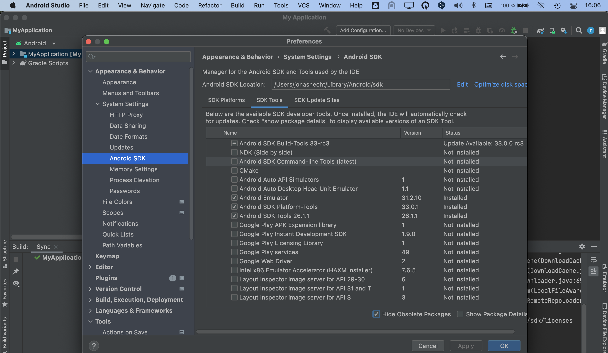

And finally run `flutter doctor --android-licenses` to accept the SDK licenses.

Now another `flutter doctor` should give you everything green:

```
$ flutter doctor
Doctor summary (to see all details, run flutter doctor -v):
[✓] Flutter (Channel stable, 2.10.5, on macOS 11.6.5 20G527 darwin-x64, locale de-DE)
[✓] Android toolchain - develop for Android devices (Android SDK version 32.1.0-rc1)
[✓] Xcode - develop for iOS and macOS (Xcode 13.2.1)
[✓] Chrome - develop for the web
[✓] Android Studio (version 2021.2)
[✓] IntelliJ IDEA Ultimate Edition (version 2021.2.2)
[✓] VS Code (version 1.62.0)
[✓] Connected device (2 available)
[✓] HTTP Host Availability

• No issues found!
```


## Start with Flutter development

Now let's dive into building our first app. There's a really nice codelab to quickstart your Flutter development skills: 

https://codelabs.developers.google.com/codelabs/first-flutter-app-pt1/#0

and later also https://codelabs.developers.google.com/codelabs/first-flutter-app-pt2/#0

Start by creating a Flutter app template with

```shell
flutter create how_to_flutter
```

This will create a new folder `how_to_flutter`, which contents I then integrated into my root directory.

Paste the `hello world` example code into [lib/main.dart](lib/main.dart):

```dart
import 'package:flutter/material.dart';

void main() {
  runApp(const MyApp());
}

class MyApp extends StatelessWidget {
  const MyApp({Key? key}) : super(key: key);

  @override
  Widget build(BuildContext context) {
    return MaterialApp(
      title: 'Welcome to Flutter',
      home: Scaffold(
        appBar: AppBar(
          title: const Text('Welcome to Flutter'),
        ),
        body: const Center(
          child: Text('Hello World'),
        ),
      ),
    );
  }
}
```

Be sure that the iOS simulator is running (`open -a Simulator` if not) and then run

```shell
flutter run
```

Now your app should run inside the simulator:

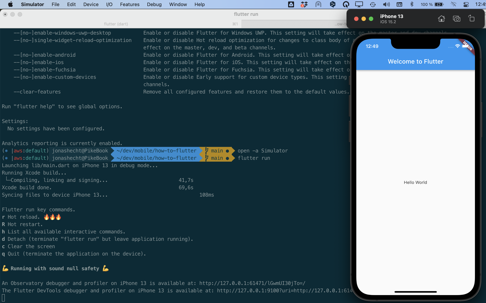

### Install Dart and Flutter Plugins in IntelliJ & configure correct SDK paths

You can choose any IDE you want (e.g. Android Studio, VSCode etc.). I went with IntelliJ and there are some plugins you should install first, which will assist you in Flutter/Dart development:

* the official Dart plugin https://plugins.jetbrains.com/plugin/6351-dart
* the Flutter plugin https://plugins.jetbrains.com/plugin/9212-flutter (and https://github.com/flutter/flutter-intellij)

In both plugins you need to configure the correct Dart and Flutter SDK paths in order to make them work.

If you use `brew install dart` for the Dart installation, the path for me was 

```
/usr/local/Cellar/dart/2.16.2/libexec
```

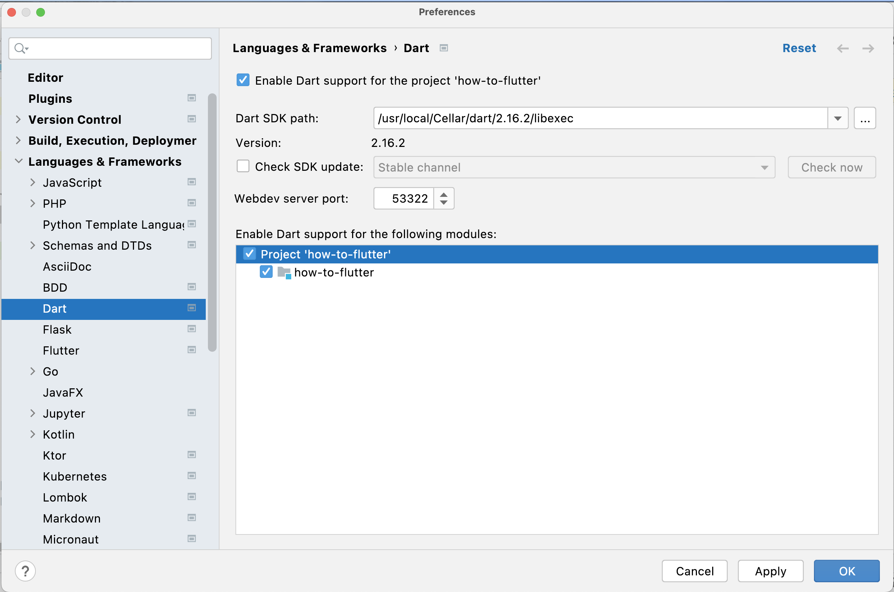

For Flutter using `brew install flutter` the path was: 

```
/usr/local/Caskroom/flutter/2.10.5/flutter
```

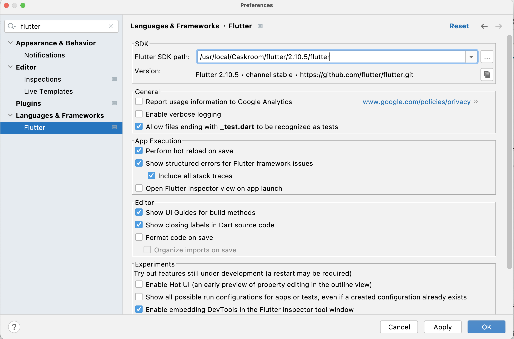


If you installed both plugins correctly, you might need to remove the `.iml` file and import the project as a new one again (at least that fixed project view for me). Now your IntelliJ has everything ready for Flutter development - including autocompletion like typing `stful` to generate a `StatefulWidget`:

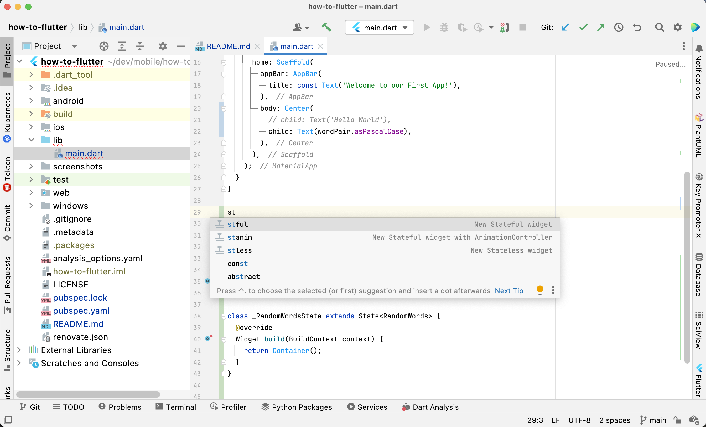


## Debugging Flutter apps from within IntelliJ

https://docs.flutter.dev/development/tools/devtools/android-studio

As described in [this blog post](https://dhanushkac.medium.com/how-to-fix-cannot-find-runner-for-main-dart-with-flutter-in-intellij-88789e8eefaa) be sure to have the Flutter IntelliJ plugin's Flutter SDK path configured correctly (as described in the section above).

Then in IntelliJ you should also be able to see your device:

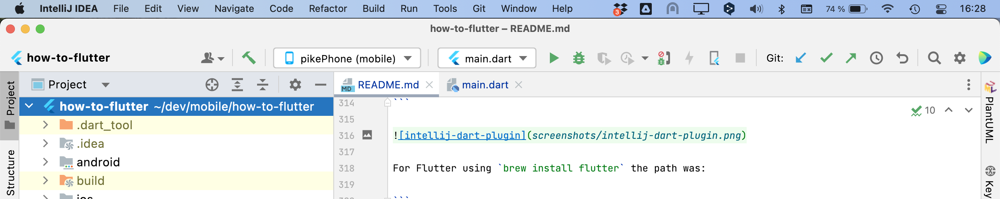

Now you should also be able to __Run__ or __Debug__ your app from within IntelliJ.

This also allows e.g. for side-by-side development possibilities:

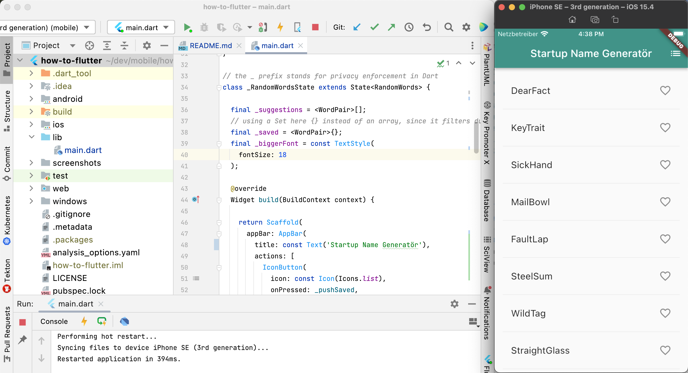


To access the [Flutter DevTools](https://docs.flutter.dev/development/tools/devtools/overview) simply click on the Button after running the app:

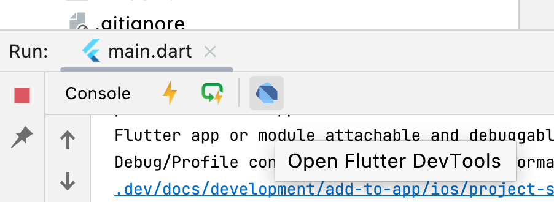

Now the DevTools should open in your Browser:

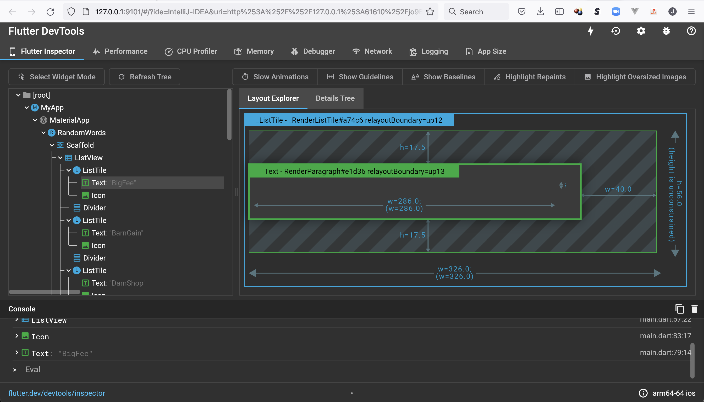


# Links and Ideas

https://blog.codecentric.de/en/2019/03/flutter-new-mobile-promise/

https://blog.codecentric.de/en/2018/10/is-flutter-ready-for-production-apps-in-q4-2018/

https://docs.flutter.dev/whats-new#may-11-2022-google-io-edition-flutter-3-release

https://medium.com/flutter/introducing-flutter-3-5eb69151622f


https://docs.flutter.dev/resources/faq#why-did-flutter-choose-to-use-dart

### Learn

https://codelabs.developers.google.com/?text=flutter

https://codelabs.developers.google.com/codelabs/first-flutter-app-pt2/#0

https://docs.flutter.dev/development/packages-and-plugins/happy-paths

https://codelabs.developers.google.com/codelabs/flutter-boring-to-beautiful#0

https://docs.flutter.dev/cookbook

https://docs.flutter.dev/resources/bootstrap-into-dart

https://developers.google.com/codelabs/from-java-to-dart#0

#### Layout tutorials:

https://docs.flutter.dev/development/ui/layout
 
https://docs.flutter.dev/development/ui/layout/tutorial

https://docs.flutter.dev/development/ui/interactive

Debugging Flutter layouts visually: https://docs.flutter.dev/development/tools/devtools/inspector#debugging-layout-issues-visually
